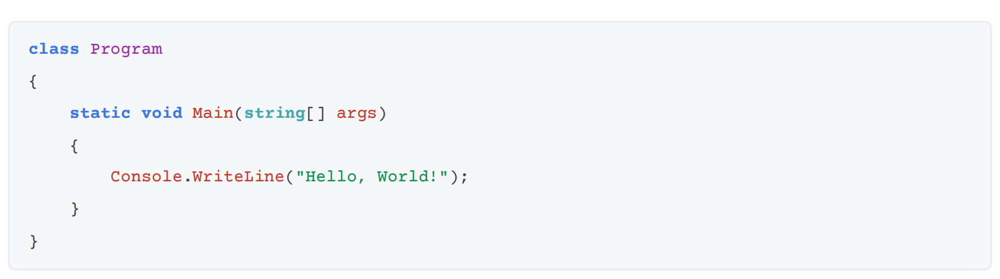
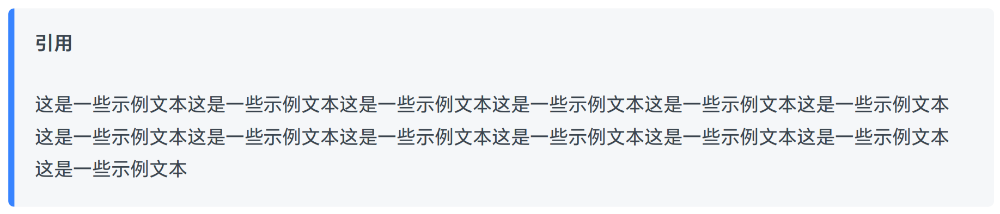
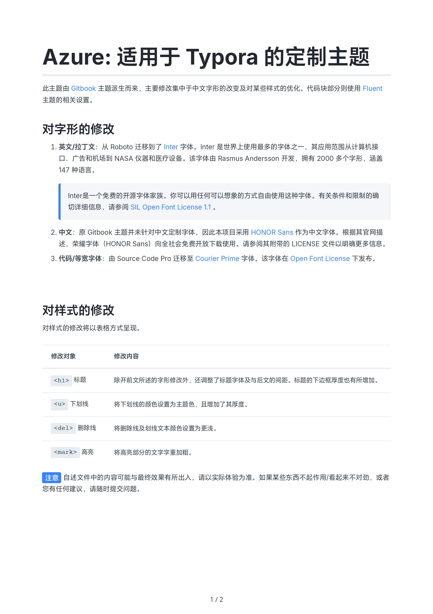
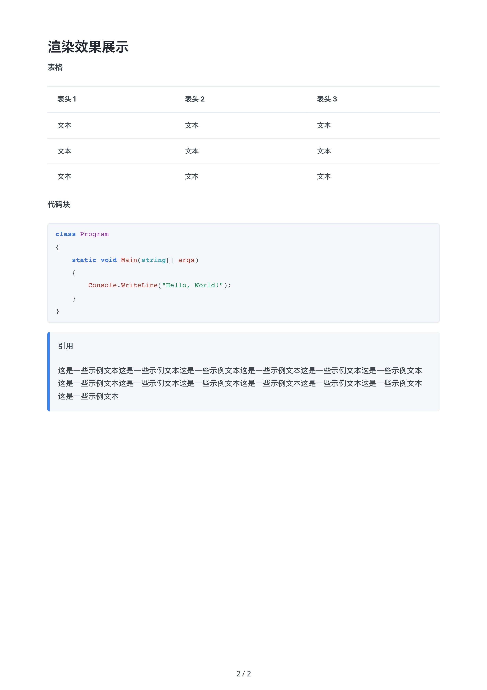

#Azure: 适用于 Typora 的定制主题

此主题由 [Gitbook](https://github.com/h16nning/typora-gitbook-theme) 主题派生而来，主要修改集中于中文字形的改变及对某些样式的优化。代码块部分则使用 [Fluent](https://github.com/li3zhen1/Fluent-Typora) 主题的相关设置。

## 对字形的修改

1. **英文/拉丁文**：从 Roboto 迁移到了 [Inter](https://rsms.me/inter) 字体。Inter 是世界上使用最多的字体之一，其应用范围从计算机接口、广告和机场到 NASA 仪器和医疗设备。该字体由 Rasmus Andersson 开发，拥有 2000 多个字形，涵盖 147 种语言。

   > Inter是一个免费的开源字体家族。你可以用任何可以想象的方式自由使用这种字体。有关条件和限制的确切详细信息，请参阅 [SIL Open Font License 1.1](https://openfontlicense.org/) 。

2. **中文**：原 Gitbook 主题并未针对中文定制字体，因此本项目采用 [HONOR Sans](https://developer.hihonor.com/cn/doc/guides/100681) 作为中文字体。根据其官网描述，荣耀字体（HONOR Sans）向全社会免费开放下载使用。请参阅其附带的 LICENSE 文件以明确更多信息。

3. **代码/等宽字体**：由 Source Code Pro 迁移至 [Courier Prime](https://quoteunquoteapps.com/courierprime) 字体。该字体在 [Open Font License](http://scripts.sil.org/OFL) 下发布。

## 对样式的修改

对样式的修改将以表格方式呈现。

| 修改对象       | 修改内容                                                     |
| -------------- | ------------------------------------------------------------ |
| `<h1>` 标题    | 除开前文所述的字形修改外，还调整了标题字体及与后文的间距。标题的下边框厚度也有所增加。 |
| `<u>` 下划线   | 将下划线的颜色设置为主题色，且增加了其厚度。                 |
| `<del>` 删除线 | 将删除线及划线文本颜色设置为更浅。                           |
| `<mark>` 高亮  | 将高亮部分的文字字重加粗。                                   |

==注意== 自述文件中的内容可能与最终效果有所出入，请以实际体验为准。如果某些东西不起作用/看起来不对劲，或者您有任何建议，请随时提交问题。

## 渲染效果展示

**表格**

**代码块**

## 在 Typora 中的自述文件渲染效果

本自述文件在 Typora 中应用 Azure 主题的渲染效果如下图所示。

